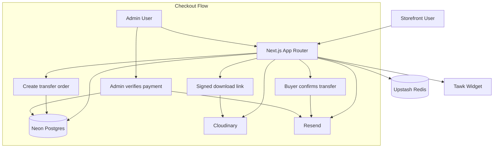

# Oxarchive

Oxarchive is a curated digital bookstore for technical, industry, and research ebooks, with a transfer-based checkout flow, manual admin payment verification, secure download access, and branded storefront experience.

## Product Goals

1. Deliver a clean reading-focused storefront with strong catalog discoverability.
2. Support transfer payments with clear buyer and admin workflow states.
3. Gate digital downloads behind verified payment and signed access.
4. Keep operations simple with practical health checks, caching, and admin tooling.

## Design Approach

The project uses a practical editorial-commerce design language:

1. Reading-first visual hierarchy:

- High-contrast typography and restrained UI chrome.
- Strong emphasis on title, author, category, and format metadata.

2. Hybrid navigation strategy:

- Persistent left sidebar for desktop.
- Mobile bottom dock for quick storefront actions and counters.

3. Intentional loading and state feedback:

- Route-level loading screens.
- Button/action loading states.
- Skeleton placeholders for smoother perceived performance.

4. Operational clarity in sensitive flows:

- Transfer confirmation timestamps.
- Admin verification queue prioritizing buyer-confirmed orders.
- Explicit paid and failed status transitions.

## Core Features

### Storefront

1. Featured landing page and full catalog.
2. Search, sorting, and filter-ready catalog APIs.
3. Ebook detail pages with metadata and pricing.
4. Favorites and cart with persisted client state.
5. Legal pages:

- Privacy Policy
- Terms and Conditions
- Return Policy

### Checkout and Fulfillment

1. Transfer order creation with unique order token.
2. Buyer transfer confirmation action.
3. Admin payment verification.
4. Purchase record creation and download token issuance.
5. Secure download route with signed link handling.

### Admin

1. Protected admin session and route group.
2. Orders queue with urgency indicators.
3. Mark paid and mark failed actions.
4. Ebook upload entry flow.
5. Bank settings management.
6. Admin email test page for transaction template validation.

### Messaging and Notifications

1. Resend-powered transactional emails.
2. Styled React email templates for:

- Buyer transfer claimed alert to admin.
- Payment confirmed message to buyer.

### SEO and Metadata

1. Structured metadata for pages.
2. Sitemap and robots configuration.
3. SEO icon pack and manifest from public seo assets.
4. Open Graph and Twitter metadata.

### Observability

1. Health endpoint for database and cache checks.
2. Redis probe including round-trip verification.

## Tech Stack

### Frontend and App Runtime

1. Next.js 16 App Router
2. React 19
3. TypeScript
4. Tailwind CSS v4
5. shadcn UI primitives
6. Lucide icons

### Data and Infrastructure

1. Neon PostgreSQL
2. Drizzle ORM
3. Upstash Redis

### Integrations

1. Cloudinary for media and asset flows
2. Resend for transactional email
3. Tawk live chat widget

### Client State and Data Fetching

1. Zustand for local persisted state
2. TanStack Query for client data workflows

## Architecture



Design summary:

1. Next.js handles routing, rendering, and server actions.
2. Drizzle provides typed query access to Neon Postgres.
3. Upstash Redis caches catalog responses and accelerates repeat queries.
4. Cloudinary serves media and signed download targets.
5. Resend handles operational and customer transactional emails.

## Project Structure

1. app:

- Storefront routes, admin routes, metadata routes, APIs.

2. components:

- Reusable UI and feature-level components.

3. db:

- Schema, query modules, and seeding.

4. lib:

- Environment parsing, integrations, utility services, and platform helpers.

5. public:

- Static assets including SEO icons and manifest.

## Getting Started

1. Install dependencies:

```bash
pnpm install
```

2. Configure environment variables in .env.

3. Run database migrations:

```bash
pnpm db:migrate
```

4. Seed base data:

```bash
pnpm db:seed
```

or categories only:

```bash
pnpm db:seed:categories
```

5. Start development server:

```bash
pnpm dev
```

## Deployment Guide

Recommended production target:

1. App hosting: Vercel
2. Database: Neon Postgres
3. Cache: Upstash Redis
4. Email: Resend
5. Media and files: Cloudinary

Deployment checklist:

1. Push migrations before deploying runtime changes:

```bash
pnpm db:migrate
```

2. Configure production environment variables in your hosting platform:

- DATABASE_URL
- UPSTASH_REDIS_REST_URL
- UPSTASH_REDIS_REST_TOKEN
- CLOUDINARY_CLOUD_NAME
- CLOUDINARY_API_KEY
- CLOUDINARY_API_SECRET
- ADMIN_SECRET
- RESEND_API_KEY
- RESEND_FROM_EMAIL
- ADMIN_NOTIFICATION_EMAIL
- NEXT_PUBLIC_SITE_URL

3. Build and verify locally before production rollout:

```bash
pnpm typecheck
pnpm lint
pnpm build
```

4. Deploy and validate:

- Confirm sitemap and robots endpoints are reachable.
- Hit `/api/health` to verify database and cache readiness.
- Use `/admin/email-test` to validate transactional email delivery.
- Run one end-to-end transfer order flow in production.

## Environment Variables

Required or commonly used values:

1. DATABASE_URL
2. UPSTASH_REDIS_REST_URL
3. UPSTASH_REDIS_REST_TOKEN
4. CLOUDINARY_CLOUD_NAME
5. CLOUDINARY_API_KEY
6. CLOUDINARY_API_SECRET
7. ADMIN_SECRET
8. RESEND_API_KEY
9. RESEND_FROM_EMAIL
10. ADMIN_NOTIFICATION_EMAIL
11. NODE_ENV

## Scripts

1. pnpm dev: run development server.
2. pnpm build: create production build.
3. pnpm start: run production server.
4. pnpm lint: run lint checks.
5. pnpm typecheck: run TypeScript checks.
6. pnpm db:generate: generate Drizzle migrations.
7. pnpm db:migrate: apply migrations.
8. pnpm db:studio: open Drizzle Studio.
9. pnpm db:seed: seed categories and ebooks.
10. pnpm db:seed:categories: seed categories only.

## Notes

1. Transfer checkout is intentionally manual-verification first.
2. Downloads are unlocked only after admin confirmation.
3. Admin routes are protected and excluded from public discovery.
4. Keep secrets out of commits and rotate leaked keys immediately.
